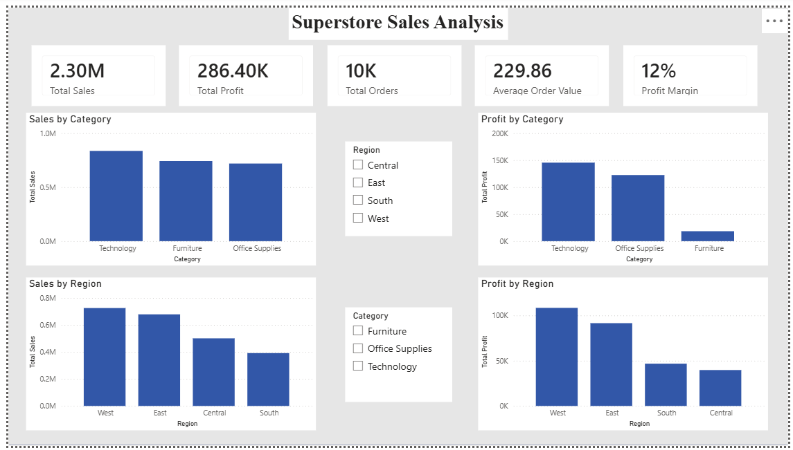
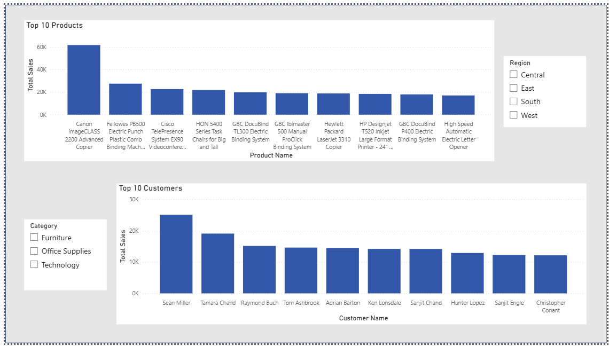

# 📊 Sales Performance Analysis

## 📌 Project Overview

This project analyzes sales data to identify business trends, top-performing products, regional sales performance, and customer purchasing behavior using Excel, SQL, Power BI, and Python.

---

## 🎯 Business Objective

The objective of this project is to transform raw sales data into actionable business insights that support data-driven decision-making.

---

## 🛠️ Tools & Technologies

- Microsoft Excel
- SQL
- Power BI
- Python
- GitHub

---

## 📂 Repository Structure

- 📁 Dataset
- 📁 SQL
- 📁 Excel
- 📁 PowerBI
- 📁 Python
- 📁 Dashboard
- 📁 Images

---

## 📈 Key Business Questions

- Which products generate the highest sales?
- Which region performs the best?
- What are the monthly sales trends?
- Which customers contribute the most revenue?
- Which categories generate the highest profit?

---

## 📊 Dashboard

Dashboard screenshots will be available in the **Dashboard** folder.

---

## 🚀 Future Enhancements

- Sales Forecasting
- Customer Segmentation
- Profit Prediction
- Interactive Power BI Dashboard

---

## 👨‍💻 Author

**Sasikumar**

Aspiring Data Analyst

LinkedIn:
https://www.linkedin.com/in/seerasasikumar

## Dashboard Preview

### Page 1

### Page 2

